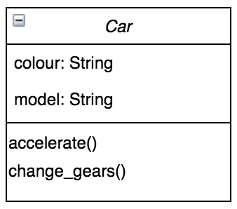
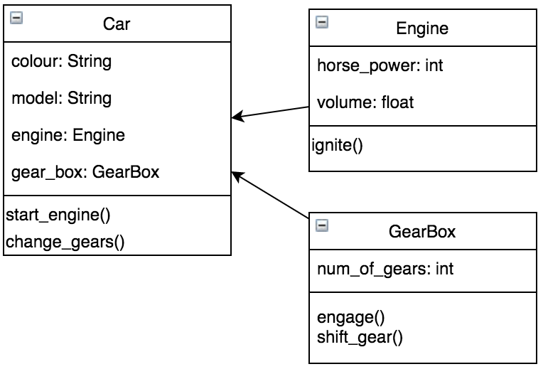

# Multiple Classes

## Preparation for Tomorrow

## Learning Objectives

- Understand the relationship between multiple classes
- Know how to use composition to design a program

# Intro

Composition and Aggregation are concepts in OOP that describes the relationship between two or more classes. In composition and aggregation, a class has an instance variable that refers to the object of another class.

# Composition versus Aggregation

There is a subtle difference between composition and aggregation.

X "owns" Y = Composition: Y has no meaning or purpose in the system without X
X "uses" Y = Aggregation: Y exists independently from X

Often these terms are used synonymously. We'll refer to it as **COMPOSITION**

A car __HAS__ an engine, a car __HAS__ a gearbox. So our car is made up of, or ***COMPOSED*** of other objects, each with their own state and behaviour.
## So What's the Big Deal?

It's an elegant way of giving an object additional behaviour!

If we think about a ```Car``` object, it can't do much without an ```Engine``` and a ```GearBox```. It could have a colour and a model but without the ```Engine``` and ```GearBox``` it doesn't have the behaviour that we want it to have. With our ```Car``` composed of an ```Engine``` and a ```GearBox``` it can actually drive.

## Composing the Car



Currently this ```Car``` class HAS-A colour and a model. Let's add an ```Engine``` and a ```GearBox```



Now can you think how the start_engine() and change_gears() methods might work?

The ```Car``` class should hand off the **responsibility** of the engine starting to the engine object itself. It might look like this:

```python
def start_engine(self):
  self.engine.ignite()
```

Similarly for the ```GearBox```

```python
def change_gears(self):
  self.gear_box.shift_gear()
```

Now we would be free to swap in and out different engine and gearbox objects (as long as they had an ignite() method and a shift_gear() method)


## Exercise

Sketch out the class diagrams for a ```Book``` class that is composed of an ```Author``` object and a ```Publisher``` object.


## Summary

We've seen how to create relationships between multiple classes using composition and we know how to use composition to design a program.

The advantages include:

1. Reuse of existing code
2. Ability to change the implementation of a class used in a composition without adapting any external clients
3. Achieves a more flexible and less rigid  design

Tomorrow we will look at coding a slightly more example using ```lists``` of objects as composition.
